<!--
  Copyright (c) 2026 Trustedwear Tech Private Limited (https://citra-ai.com)
  Author: Rohit Kumar Chandan
  SPDX-License-Identifier: Apache-2.0

  Licensed under the Apache License, Version 2.0 (the "License"); you may not
  use this file except in compliance with the License. You may obtain a copy of
  the License at http://www.apache.org/licenses/LICENSE-2.0
-->

# Citra Decks

**Sovereign presentations, visual reports and long-form documents — generated
from your own data, on your own infrastructure.**

Three composers, one engine:

- **Presentations** — slide decks grounded in your operational data
- **Visual reports** — print-ready A4 documents
- **Long-form documents** — Word-style reports drafted from your knowledge base

Hand it your project — the documents, the spreadsheets, the standards you work
to — and it writes from those. Every figure traces back to a source, and the
deck can be regenerated when the data changes.

<p align="center">
  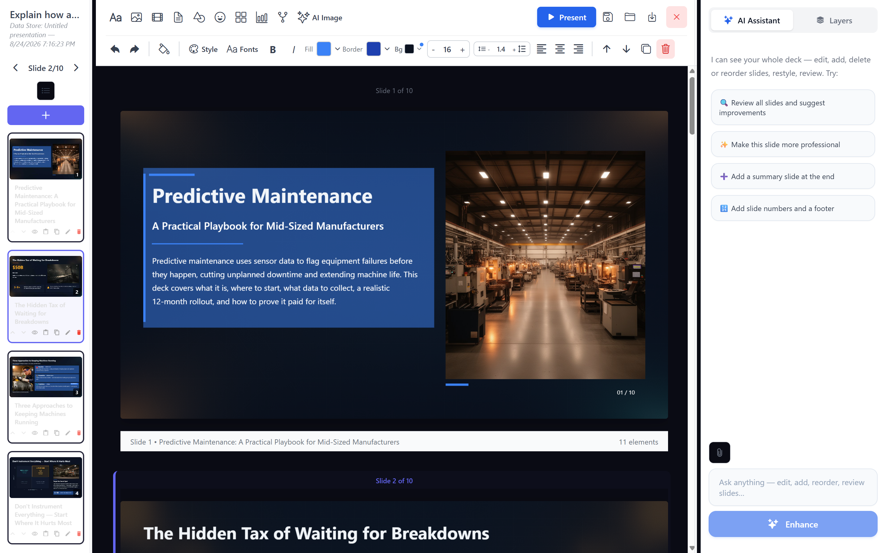
</p>

<p align="center"><i>Written from a one-paragraph brief and the documents you
attached — then editable element by element, or by asking.</i></p>

## Support this project

Citra Decks is Apache-2.0 and free to run on your own infrastructure, forever.
Sponsorship funds maintenance, the documentation, and the hosted demo people try
before they self-host.

**[→ Support this project](https://citra-ai.com/open-source)**

<sub>Contributions go to Trustedwear Tech Private Limited, which maintains this
project. They are not tax-exempt donations, and they buy no licence, warranty,
support entitlement or influence over the roadmap — the project stays
Apache-2.0 either way.</sub>

### What makes it different

|  |  |
|---|---|
| **You give it the project, not a prompt** | Every tool takes an attachment. This takes your **project's material** — the spec, the spreadsheets, last quarter's report, the standards you work to — and keeps it as a knowledge store for that deck. The outline, every slide and every later edit are written from it, so the system knows what you are building rather than guessing from one paragraph. → [Where your documents go in](#where-your-documents-go-in) |
| **The numbers are computed, not written** | For a spreadsheet the model is asked for a small Python script, which runs in a sandbox against your actual file; the **result** goes on the slide. A model asked to "sum column D" gives a confident wrong number. → [How a deck gets made](#how-a-deck-gets-made) |
| **You change it by asking** | Reopen a deck and say what you want in ordinary words. It tells you what it worked out from your content before it writes anything. → [Come back to it](#come-back-to-it-and-change-it-by-asking) |
| **It runs on your infrastructure** | Your Milvus, your object storage, your model endpoint. Point it at a local vLLM and nothing leaves your network. → [Why self-host this](#why-self-host-this) |


## Why self-host this

Presentation and document tools are where confidential material goes to get
formatted. Board packs, incident reports, credit memos, patient summaries — the
things you would least like to paste into someone else's cloud.

Start on a hosted model API to evaluate. Point `LLM_LARGE_BASE_URL` at your own
vLLM or Ollama endpoint for production, and nothing leaves your network.

## How a deck gets made

Worth understanding before you run it, because it explains what the stack is
for. A generic slide tool asks a model to write plausible bullets. This asks a
different question — *what do your documents and spreadsheets actually say?*

```
   Goal ("Q3 collections review for the board")
     │
     ├── retrieval ──► your uploaded documents  ──► cited passages
     │                 (Milvus vector search)
     │
     ├── computation ─► your spreadsheets       ──► real figures
     │                 (Python in a Docker sandbox)
     │
     ▼
   Outline ──► slide/page generation ──► editable canvas ──► export
```

Two consequences drive most of the design:

- **The vector database is not optional.** Retrieval *is* the product. Without
  embeddings configured you have an expensive way to ask a model to guess —
  which is why the wizard now sets them up rather than leaving them blank.
- **Numbers are computed, not generated.** The model is asked for a small
  Python script, which runs in a sandbox against your actual Excel/CSV with the
  files mounted read-only; the **result** goes on the slide. A model asked to
  "sum column D" gives a confident wrong number. A model asked to write
  `df['D'].sum()` gives a correct one.

One more piece worth knowing: the deck is **rendered to an image, critiqued by
a vision model, and patched** from that critique. It is why the output does not
look like a wall of bullets. `ARCHITECTURE.md` has the full pipeline and the
module map for all three composers.

### Where your documents go in

Attaching a file is not the point — every tool does that, for one prompt, and
forgets it. The point is that your project's material becomes a **standing
knowledge store for that deck**: the spec, the spreadsheets, the standards you
work to, last quarter's numbers. The outline is built from it, every slide is
written from it, and the edit you ask for in three weeks still reads it.

That is what "grounded" has to mean for corporate work. A board pack, a credit
memo or an incident report is not a writing task — it is a summarising task
over material that already exists, and the tool either has that material or it
is inventing.

**Before the deck exists**, on the goal step: attach the material and it is
chunked, embedded and stored before a single slide is written. The outline is
built from it.

<p align="center">
  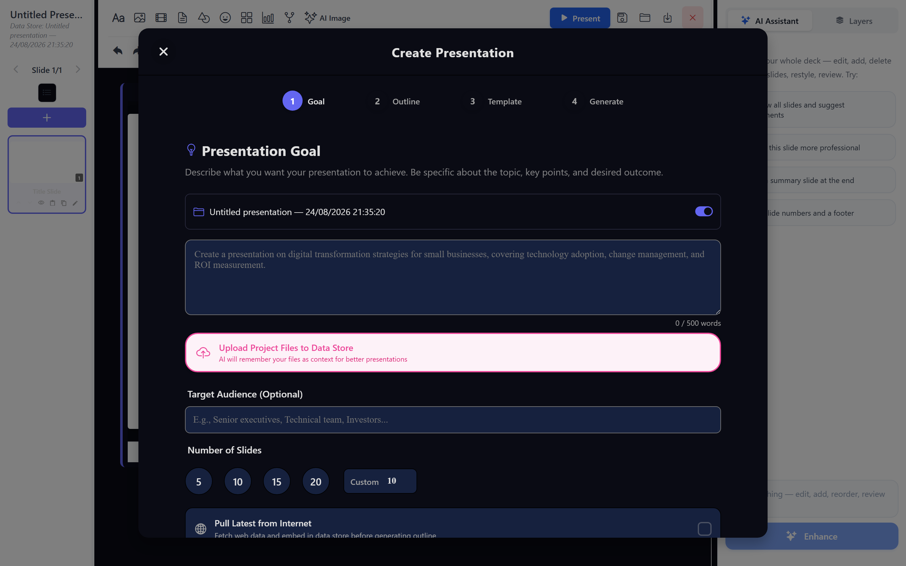
</p>

<p align="center"><i>Each deck gets its own data store — the folder named at the top of this step. Files land there, not in a global pile, so two decks never read each other's material by accident.</i></p>


**Once the deck is open**, from the paperclip beside the AI chat: add one more
document mid-conversation and ask for a change that uses it.

<p align="center">
  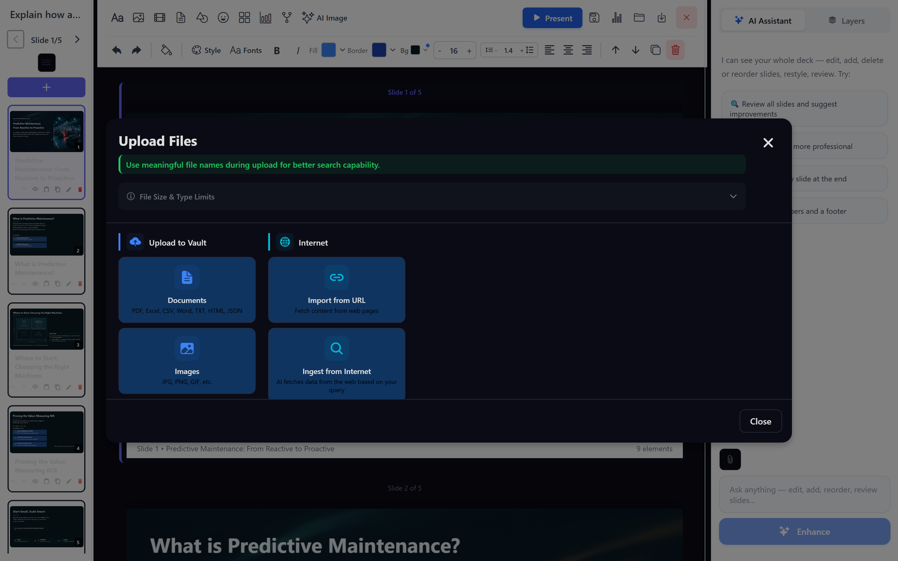
</p>

<p align="center"><i>PDF, Excel, CSV, Word, TXT, HTML and JSON, plus images — or pull the source straight off a URL. Spreadsheets are not just read: the numbers on your slides are computed from them in a sandbox, not generated.</i></p>

Both routes land in the same place: your own Milvus, in a store scoped to that
deck, where the documents **stay until you delete them**. Come back in a month,
open the deck, ask for a change — it still has the source material. Nothing is
sent anywhere else, and nothing is retained by a third party, because the
vector database and the model endpoint are both yours.

### What that looks like

One unbroken run on a local install — the goal below produced the outline
below it, which produced the deck at the end. Reproduce it with
[`scripts/capture_screens.py`](scripts/capture_screens.py).

**1 — Pick what you are making.** Slides, a visual report, or a Word-style
document. Same pipeline, three composers.

<p align="center">
  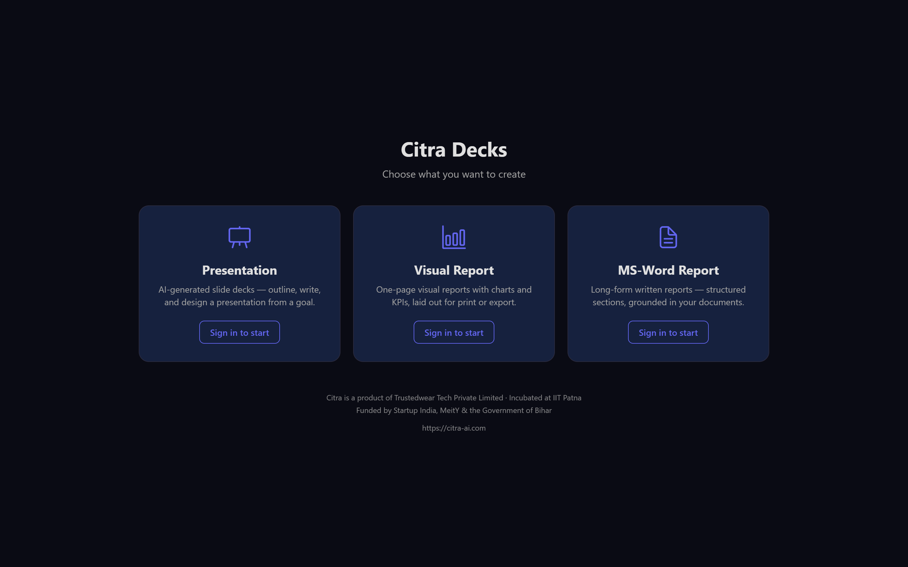
</p>

<p align="center"><i>Accounts are local — citra-decks issues its own JWTs, there is no external auth service to stand up.</i></p>


**2 — Say what the deck is for.** Not a topic — a goal, with the audience and
the length you want. This is the only prose you have to write.

<p align="center">
  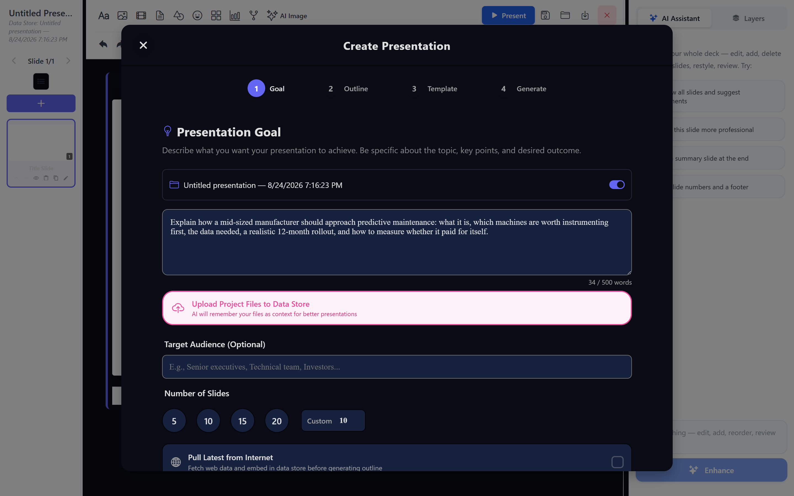
</p>

<p align="center"><i>Point it at your uploaded documents and spreadsheets here too; retrieval and computation both key off this step.</i></p>


**3 — Review the outline before anything is built.** Reorder, edit, delete, add.
Ten slide generations are expensive; the cheap moment to disagree is now.

<p align="center">
  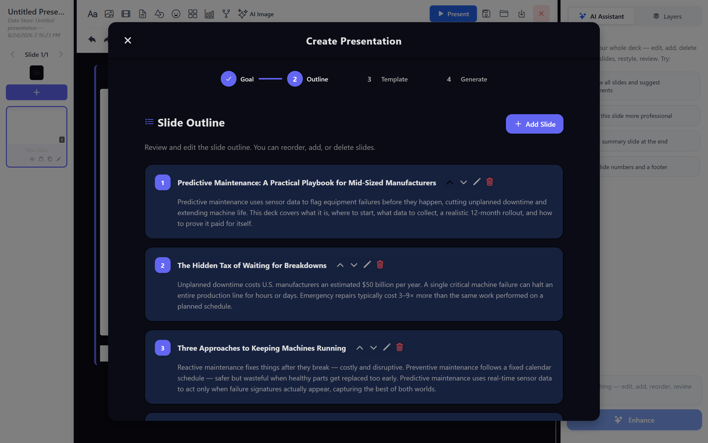
</p>

<p align="center"><i>Each slide arrives with its argument stated, so you are approving a structure rather than a list of titles.</i></p>


**4 — Choose a look, then let it write.** Slides are generated in parallel, each
one rendered, critiqued by a vision model, and patched from that critique.

<p align="center">
  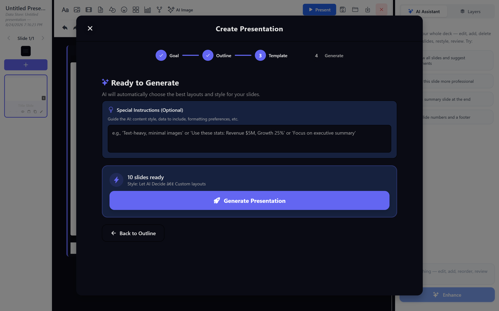
</p>

<p align="center"><i>The look is applied at generation time, not painted on afterwards.</i></p>

<p align="center">
  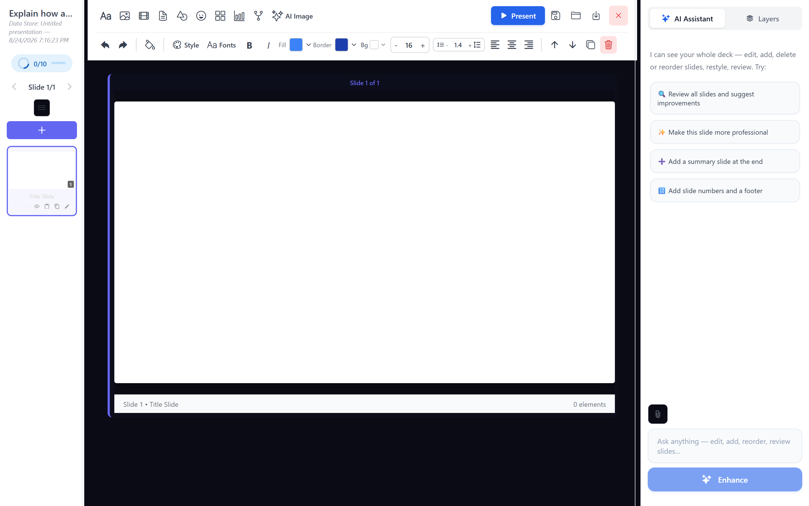
</p>

<p align="center"><i>Ten real model calls. This is the slow part, and the part that is doing the work.</i></p>


**5 — Then it is yours.** A normal editable canvas: every element selectable,
the AI panel alongside for whole-deck edits ("add a summary slide at the end"),
and Present/export when you are done.

<p align="center">
  
</p>

<p align="center"><i>Nothing here is a preview — it is the deck, editable element by element.</i></p>

### Come back to it, and change it by asking

A deck you cannot reopen is a screenshot. This is the other half of the loop.

**6 — Reopen it.** Decks are saved explicitly — the save icon in the toolbar,
never automatically — and come back with their slides, images and layout
intact.

<p align="center">
  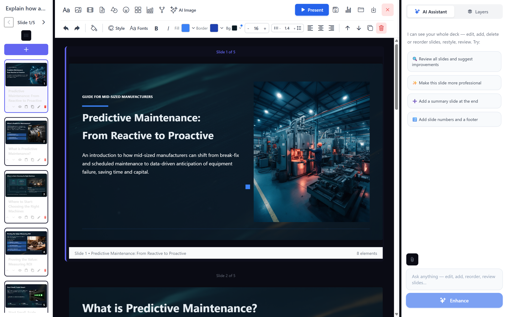
</p>

<p align="center"><i>Reopened after a full page reload. The images are served from your own object storage (MinIO locally, S3 or anything S3-compatible in production).</i></p>


**7 — Ask for the change in the same words you'd use with a colleague.** No
selecting elements first, no menus to find. The assistant can see the whole
deck.

<p align="center">
  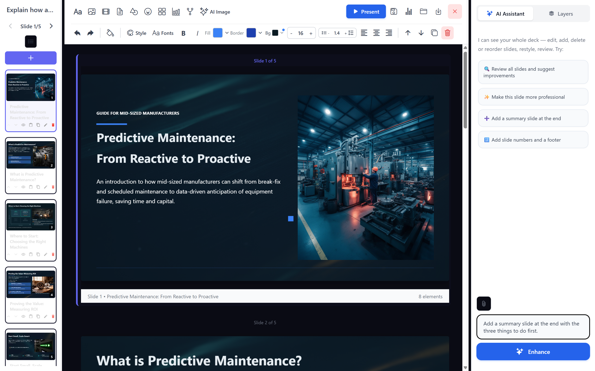
</p>

<p align="center"><i>The deck is the context. "At the end", "the three things to do first" — it resolves those against what is actually on the slides.</i></p>


**8 — It tells you what it worked out, then does it.** The reply is not a
progress bar: it says which three things it took from your content and why,
before it writes anything.

<p align="center">
  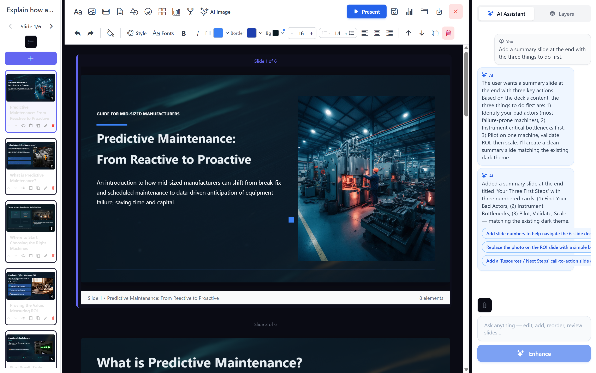
</p>

<p align="center"><i>Slide count goes 5 → 6. It named the steps from the deck's own content (find your bad actors, instrument bottlenecks, pilot then scale) and matched the existing dark theme rather than inventing a new look — then offered the next things you might want.</i></p>


## Quickstart

### Prerequisites

| Need | Why |
|------|-----|
| **Docker Engine 24+** with Compose v2 | runs the whole stack |
| **16 GB+ RAM** | Milvus is the heaviest container |
| **An OpenRouter key** | drafting, grounding and vision |
| **A Runware key** | generated imagery — required, a few cents per image |

### Easiest: the wizard

```bash
git clone https://github.com/Trustedwear-Tech/citra-decks.git
cd citra-decks
make wizard
```

It asks for two keys — one OpenRouter key, wired to drafting, embeddings and
vision, and one Runware key for generated imagery — then brings the stack up.
Both are required; every model choice it writes is a quick-start default you
can change in `.env` afterwards.

> **No `make`?** It is not installed by default on Windows, and the targets are
> thin wrappers — run the scripts directly instead:
> `bash scripts/quickstart/wizard.sh`

### Or by hand — two phases

```bash
make setup                     # or: bash scripts/quickstart/setup.sh
#   generates .env, starts the data stores, creates the MinIO bucket

# set your key in .env  ->  LLM_LARGE_API_KEY / EMBEDDING_API_KEY

make start                     # or: bash scripts/quickstart/start.sh
#   builds and starts the backend, collaboration server and web shell
```

`.env.example` is the template. `make ps`, `make logs` and `make down` manage
the running stack; see the `Makefile` for the full target list.

If either phase fails, [`docs/troubleshooting.md`](docs/troubleshooting.md)
brings each layer up by hand with a check after every step, so you can find the
one unhappy container instead of re-running the lot.

Once it's up:

| Service | URL |
|---|---|
| Web UI (Presentation / Visual Report / MS-Word Report) | http://localhost:8094 |
| Backend API (docs at `/docs`) | http://localhost:8093 |
| Real-time collaboration (Yjs/WebSocket) | ws://localhost:1234 |
| MinIO console | http://localhost:9023 |

Ports deliberately avoid the conventional 8081/8085/27017/19530/6379/9002 —
citra-decks can run alongside another Citra product's stack on the same
machine without a port collision. Override any of them via `.env`
(`BACKEND_HOST_PORT`, `WEB_HOST_PORT`, `MONGODB_PORT`, `MILVUS_PORT`,
`MILVUS_METRICS_PORT`, `REDIS_HOST_PORT`, `MINIO_API_PORT`,
`MINIO_CONSOLE_PORT`) if you'd rather use the defaults.

There is no seeded account — register your first user from the web UI's sign-up
screen. `api/local_auth.py` issues its own JWTs (bcrypt-hashed passwords, a
`users` collection); there is no separate user-service to stand up.

Three things to know about those accounts:

- **All accounts are equal.** There is no admin role and no orgs — every
  account is its own private workspace (its `personal_sa_id` owns its folders,
  decks and reports).
- **Registration is open** to anyone who can reach the port. Fine on a laptop;
  on a shared network, front it with something that controls access.
- **Password reset is not wired up.** The forgot-password endpoint is a
  deliberate stub (it never sends anything), so a lost password means resetting
  the hash in Mongo by hand. Keep your password safe.

## Architecture

Ten containers in three layers. Worth a minute now — when something misbehaves,
knowing which layer it lives in is most of the diagnosis.

| Container | Layer | What it does | Port |
|---|---|---|---|
| `web` | edge | the UI — Presentation, Visual Report, MS-Word Report | **8094** |
| `backend` | app | the API: drafting, composing, image generation, exports. OpenAPI at `/docs` | **8093** |
| `collaboration-server` | app | real-time multi-user editing (Yjs over WebSocket) | **1234** |
| `mongodb` | data | decks, reports, users — all application state | 27018 |
| `mongodb-init-rs` | data | one-shot: initiates the replica set, then exits | — |
| `redis` | data | cache, and collaboration coordination | 6382 |
| `minio` | data | uploaded documents, generated imagery, exports | 9022 / **9023** console |
| `milvus` | data | vector store — grounds drafts in your uploaded documents | 19531 / 9092 |
| `milvus-etcd` | data | Milvus's metadata store, internal to it | — |
| `milvus-minio` | data | Milvus's own object store — **not** the same as `minio` above | — |

Two things that look like faults and are not: **`mongodb-init-rs` showing
`Exited (0)` is success** — it is a one-shot job — and the **two MinIO
containers are not duplicates**; one is Milvus's private store, the other holds
your uploads and exports.

Everything here is required. There is no cut-down mode: the imagery and the
document grounding are what the product is.

### What depends on what

```
  milvus-etcd ──┐
                ├──> milvus ───┐
  milvus-minio ─┘              │
  mongodb ──> mongodb-init-rs ─┤
  redis ───────────────────────┼──> backend ──┬──> web                   (8094)
  minio ───────────────────────┘              └──> collaboration-server  (1234)
```

That is also the manual bring-up order, and it explains the most common
confusion: a `backend` that restart-loops is nearly always a **data layer**
problem, not a backend one.

### How a request flows

Your browser loads `web` on **8094**, which calls `backend` on **8093** for
everything — drafting, images, exports. The editor separately holds a WebSocket
to `collaboration-server` on **1234**.

Those being two different connections is useful to know: if a deck loads and
renders but live edits do not sync between browsers, only the collaboration
server is implicated. Nothing else needs looking at.

### When it does not work

[`docs/troubleshooting.md`](docs/troubleshooting.md) has the manual bring-up
step by step, a one-line health check per container, and a symptom-to-cause
table. Written for exactly the case where the wizard failed and you want to
bring each layer up yourself.

## What is here

| Path | What |
|---|---|
| `presentation_api.py`, `slide_templates.py` | deck generation |
| `printable/` | A4 visual reports |
| `composer_*.py`, `services/edit_orchestrator.py` | the shared authoring engine |
| `ui/composer`, `ui/printable` | the editors |
| `App.js`, `screens/`, `components/`, `contexts/` | the host shell — landing page, auth, folder-per-artifact flow |
| `collaboration-server/` | real-time co-editing (Yjs + WebSocket), its own container |
| `api/local_auth.py` | register/login/forgot-password — no external auth service needed |
| `citra-*/` | six shared packages, vendored |

It also carries the platform spine the composers need — RAG retrieval, document
ingestion, object storage, personal vaults. That is not accidental bloat: the
composers ground their output in your documents, and the retrieval path is the
product. See `VENDORED.md`.

### Folder-per-artifact

Every presentation, visual report, and long-form document gets exactly one
auto-created folder the moment you start it — there is no folder picker
anywhere in the product. Source documents in that folder ground the
generation; toggle "use data source" off per-artifact to generate AI-only
instead. The folder's contents are visible from a button in each composer's
toolbar.

Two ways in, both verified end to end (upload → extract → embed with bge-m3 →
retrievable through the composers' vault prefetch):

**The upload button in each composer** posts to `POST /v2/documents`. Driving
it directly takes the same four fields the UI sends:

```bash
curl -X POST http://localhost:8093/v2/documents \
  -H "Authorization: Bearer $TOKEN" \
  -F "file=@policy.md" -F "document_id=$(uuidgen)" \
  -F "filename=policy.md" -F "folder_id=<id>"
```

**`POST /from-url`** fetches a page instead of taking a file:

```bash
curl -X POST http://localhost:8093/from-url \
  -H "Authorization: Bearer $TOKEN" -H "Content-Type: application/json" \
  -d '{"url":"https://example.com/policy","folder_id":"<id>","topic":"policy"}'
```

It accepts **HTML only** — a `text/plain` or raw-markdown URL is rejected on
content type.

> Ignore the commented-out `@router.post("/upload")` in
> `api/chunked_documents.py`. It is a superseded v1 handler whose service
> method no longer exists; `/v2/documents` replaced it. It is dead code, not a
> missing feature.

## Model configuration

The wizard asks for **one OpenRouter key** and wires it to all three roles.
Every default is open-weights:

| Role | Default | Notes |
|---|---|---|
| Drafting | `deepseek/deepseek-v4-pro` | `LLM_LARGE_MODEL` — the reasoning tier |
| Cheap calls (titles, intent, diagrams) | `deepseek/deepseek-v4-flash` | `LLM_SMALL_MODEL` / `LLM_MEDIUM_MODEL` |
| Slide + report layout | `z-ai/glm-5.1` | `PRESENTATION_LLM_MODEL` / `PRINTABLE_LLM_MODEL` — measurably better structure than the general-purpose tier |
| Embeddings | `baai/bge-m3` at 768 | the client sends `dimensions`, so it returns 768 rather than its native 1024, matching the Milvus collection |
| **Image generation** | **required — Runware, `runware:400@1`** | cover art and section imagery. Its own key: the one thing the OpenRouter key does not cover |
| Vision (layout critique) | `qwen/qwen3-vl-32b-instruct` — **off** | `CRITIC_VISION_ENABLED=false`. Turn on only if you see glitches |

**Image generation is required, and the wizard will not continue without it.**
Without imagery the composers still generate, but the output is plain — no
cover art, no section visuals, just text and charts. That is the largest
single difference between a deck that looks designed and one that reads like
an outline, and it costs a few cents an image, so declining saves nothing
worth having.

**The wizard configures Runware and nothing else** — deliberately. It is what
this product has actually been built and tested against, and it is the only
backend whose image **edit** action works, so it is the one configuration
guaranteed to behave on a first run. Two other backends are supported in code
and documented in `.env.example`, and switching to either is an `.env` edit
after setup rather than another trip through the wizard:

| `IMAGE_GEN_PROVIDER` | What it is | Editing |
|---|---|---|
| `runware` | What the wizard sets. `IMAGE_GEN_API_KEY` and you are done. | ✅ |
| `openai` | Any OpenAI-compatible `/images/generations` endpoint — Together, Fal, DeepInfra, Nebius, or your own — which is how you run **FLUX** without a Runware account. Set `IMAGE_GEN_BASE_URL` and `IMAGE_GEN_MODEL` too. | ✗ |
| `comfyui` | Self-hosted ComfyUI; nothing leaves your network. | ✗ |

If you genuinely want imagery off, that too is an `.env` decision — set the
variables yourself and skip the wizard.

**Leave vision off until you need it.** It is a separate thing from image
generation: it re-renders each finished slide and sends the picture to a
vision model to find overlaps and patch the layout. That is real time and
tokens on every generation, for a problem most decks do not have. If you do
see elements overlapping or text running off a slide, set
`CRITIC_VISION_ENABLED=true` — the credentials are already configured.

Everything routes through whichever endpoint the matching `*_BASE_URL` points
at, so **swapping is an `.env` edit, not a migration**: point them at your own
vLLM or Ollama and nothing leaves your network.

> **Changing the embedding model means re-ingesting**, even at the same
> dimension. Vectors written by one model do not share an embedding space with
> another model's queries, so previously uploaded documents quietly stop
> matching rather than failing loudly.

## Requirements

Docker + Docker Compose (the quickstart stack: Mongo, Milvus, MinIO, Redis,
the backend, the collaboration server, the web shell) · an OpenAI-compatible
model endpoint for generation.

## Community

**Discord:** https://discordapp.com/channels/1519703038724669551/1519703039416467518
— shared with Citra Flows and Citra Projects. Questions, setup issues, or
what a real deployment needs that isn't here yet.

## Licence

**Apache License 2.0** -- open source, no strings.

Use it, modify it, run it in production, offer it as a service, fold it into a
commercial product. No non-production restriction, no Change Date, no licence to
buy. See [`LICENSE`](LICENSE) and [`NOTICE`](NOTICE).

This was previously Business Source License 1.1, which reserved production use.
That restriction is gone and does not come back: an Apache grant is
irrevocable.

The vendored Citra Common packages (`citra-auth/`, `citra-cache/`,
`citra-llm/`, `citra-mongo/`, `citra-queue/`, `citra-service-utils/`) were
always Apache-2.0 and are unchanged.

Citra is a product of Trustedwear Tech Private Limited · Incubated at IIT
Patna · Funded by Startup India, MeitY & the Government of Bihar.

https://citra-ai.com
